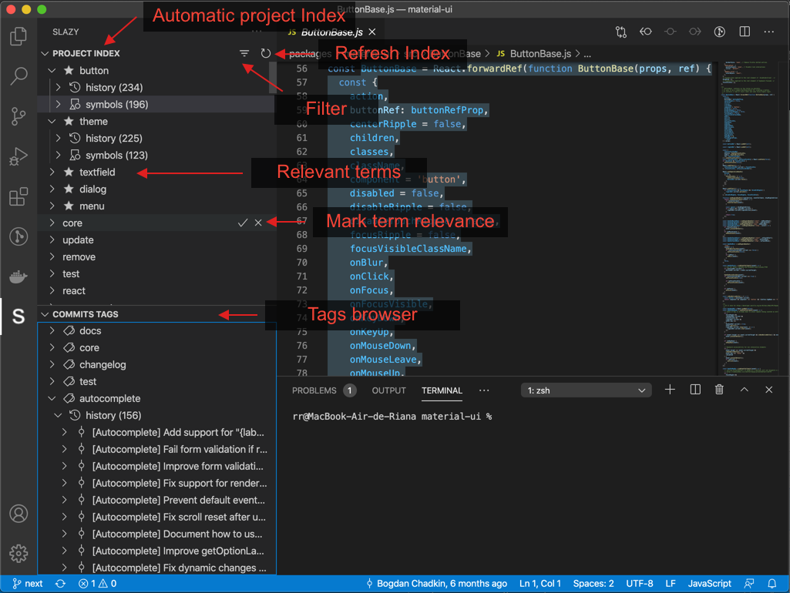

# Slazy (beta)

Slazy for Visual Studio Code is an extension that makes it more natural to work on your code base.

Slazy creates a browsable index from your project contents such as git commit comments, documentation and code symbols, then allows you to browse and navigate through all the assets related to a keyword from the index.

**Note : The development is still at an early stage and some features are not fully operational especially on project with lots of commits.**

Slazy should work with any language supported by Visual Studio Code, and has been tested with : Javascript, Typescript, Python and Java.

Benefits :
- quickly identify which file and symbols (variables, functions, classes...) are involved in a feature implementation
- find out quickly how was implemented a feature
- find all available documentation around a feature
- faster issue fixing
- faster onboarding on a new project

## Features

- Automatically Create a sorted index for the most used terms in your code base : commits, symbols, docs
- Mark index terms as irrelevant or important
- View and navigate to symbols associated to terms
- Savigate to related commits
- Search term from index
- Index commits from tags formatted with brackets like [fix], [issue], [core]....

The illustration below was made with Slazy running on  [material-ui](https://github.com/mui-org/material-ui) source code.

## Requirements

- The project must be a git repository clone

## Known Issues

- If commits are not explicit like "quick fix" or other, the index may be noisy
- Indexing and displaying symbols may take some time on large projects
- Code navigation may not be very accurate on file with a large history
- If no symbols are found, open one file of the project such as .js, .ts, .py... and reload the index with the button on the top right of the project index view

## Feedback

You can file issues or suggest features from the github issue page : https://github.com/slazy-io/slazy-vscode-docs/issues

## Release Notes

### 0.0.2
- First step performance improvement on large projects
- Commit messages tag extraction and indexing
- let the user teach slazy which terms are relevant or irrelevant
- limit maximum number of visible terms for performance and hide irrelevant terms

### 0.0.1
- Update marketplace description
- Fix import crash on some projects

